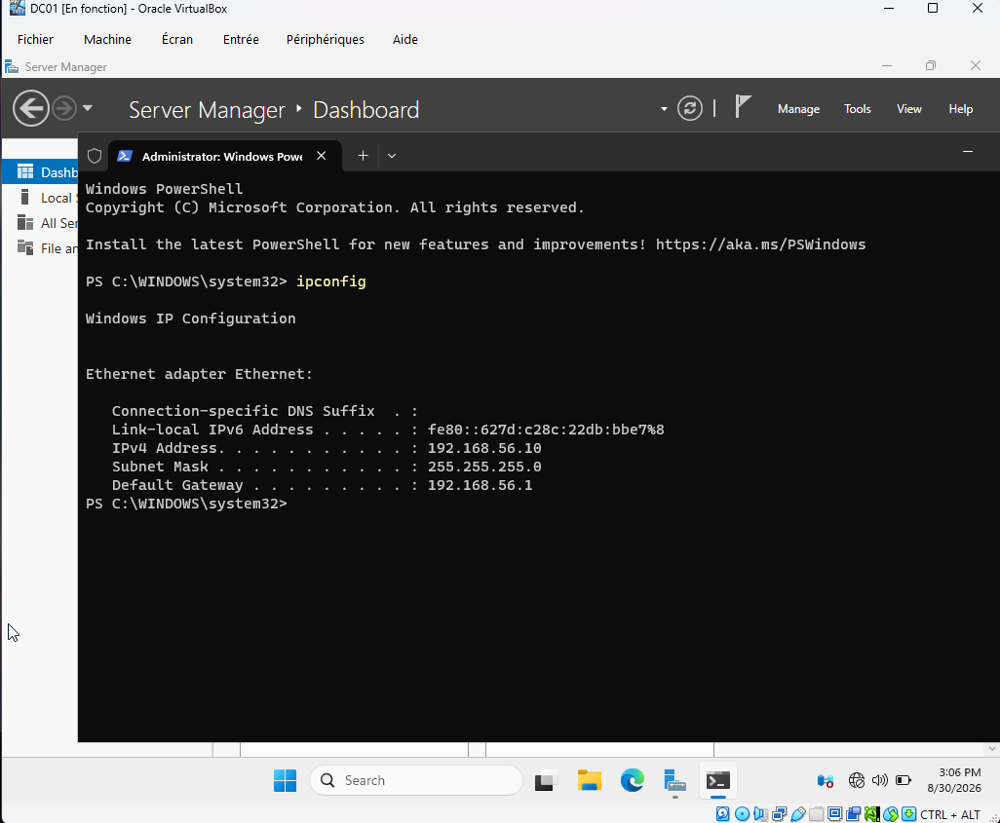
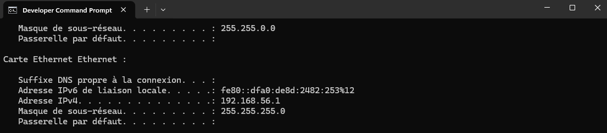
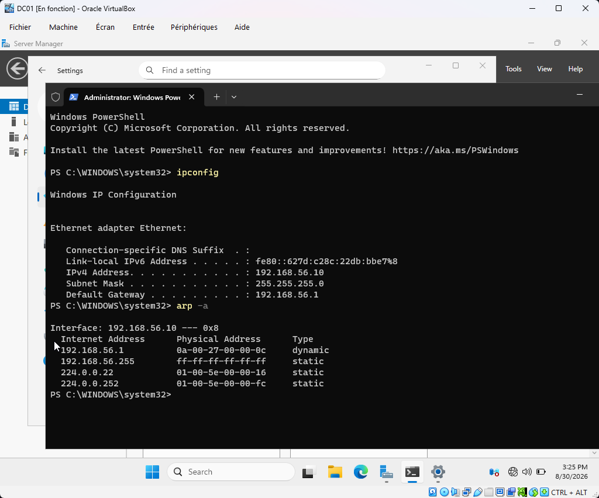
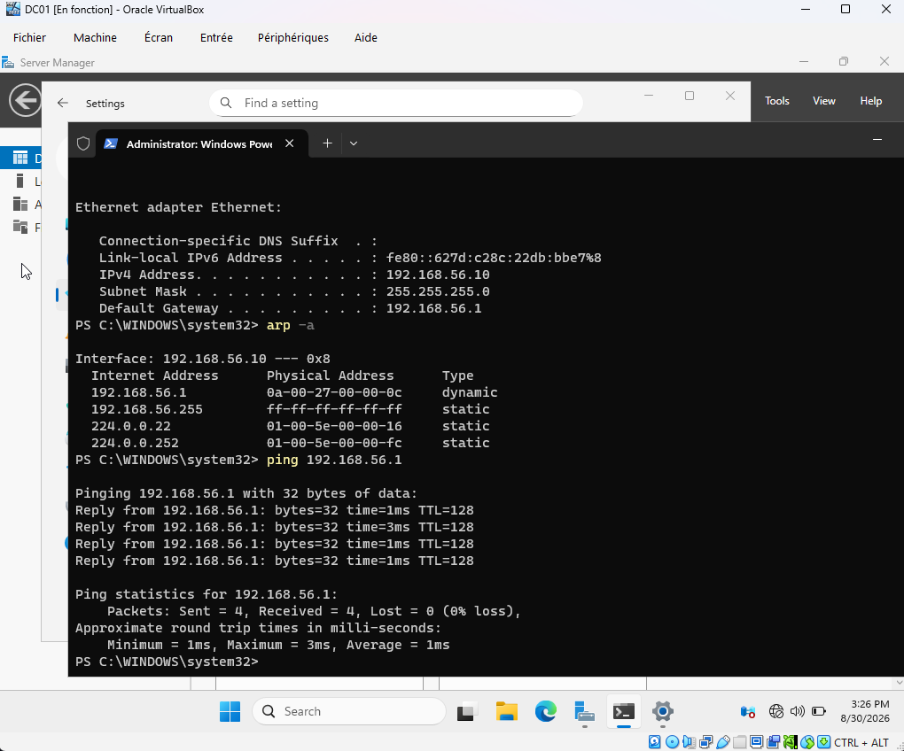
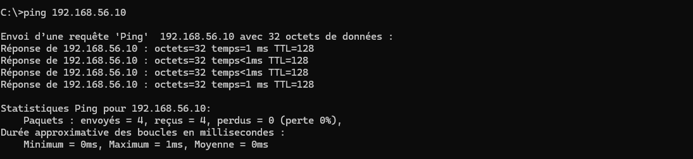

# Portfolio – Administration Système & Cybersécurité

Bienvenue sur mon portfolio professionnel.  
Je m'appelle **Tommy**, passionné par l'administration système, la cybersécurité et la virtualisation.

Ce portfolio présente mes projets techniques, dont un laboratoire Active Directory complet configuré dans un environnement sécurisé.

---

## 🛠️ Projet : Laboratoire Active Directory (VirtualBox + Windows Server)

### 🎯 Objectif
Mettre en place un environnement Active Directory complet dans VirtualBox, en respectant les bonnes pratiques de sécurité.

---

## 🧱 Architecture du laboratoire

**DC01 – Windows Server 2022**
- Rôle : Contrôleur de domaine
- IP : 192.168.56.10
- Réseau : Host-Only
- Pare-feu : Profil Public (activé)

**PC-Client – Windows 11**
- Rôle : Client du domaine
- IP : 192.168.56.1
- Réseau : Host-Only

---

## 🔍 Étapes techniques

### 1. Configuration réseau
- Création du réseau Host-Only
- Attribution des IP statiques
- Vérification ARP
- Tests ICMP

### 2. Sécurité : Pare-feu Windows
- Profil Public conservé sur DC01
- Activation ciblée de ICMPv4-In
- Justification : diagnostic minimal + sécurité maximale

### 3. Installation AD DS
- Ajout du rôle Active Directory Domain Services
- Promotion du serveur en contrôleur de domaine
- Création du domaine : exemple.local

### 4. Configuration AD
- Création des OU
- Création des utilisateurs
- Création des groupes
- Attribution des permissions

### 5. GPO
- Mot de passe complexe
- Verrouillage de session
- Restrictions logicielles

### 6. Tests
- Joindre le PC-Client au domaine
- Connexion avec un utilisateur du domaine
- Application des GPO

---

## 📸 Captures d’écran
---

## 🌐 Réseau & VirtualBox

Cette section illustre la configuration réseau du laboratoire Active Directory dans VirtualBox.  
L’objectif est de garantir une communication isolée et sécurisée entre le contrôleur de domaine (DC01) et le poste client.

### ⚙️ Configuration du réseau VirtualBox
Le réseau utilisé est de type **Host‑Only**, permettant une connexion directe entre les machines virtuelles sans accès Internet.

> Configuration du réseau Host‑Only dans VirtualBox – interface privée entre DC01 et PC‑Client.

---

### 🧩 Paramètres IP des machines
**DC01 – Windows Server 2022**
- IP : 192.168.56.10  
- Masque : 255.255.255.0  
- Profil : Public (pare‑feu activé)

> Paramètres IP statiques du contrôleur de domaine DC01.

**PC‑Client – Windows 11**
- IP : 192.168.56.1  
- Masque : 255.255.255.0  
- Profil : Public (pare‑feu activé)

> Paramètres IP statiques du poste client.

---

### 🔍 Vérification de la connectivité
Les tests ARP et ping confirment la communication entre les deux machines.

> Table ARP de DC01 – les deux machines se voient sur le réseau Host‑Only.

> Test de ping depuis DC01 vers le PC‑Client.

> Test de ping depuis le PC‑Client vers DC01.

---

### 🧠 Résumé
Cette configuration réseau démontre :
- la maîtrise de VirtualBox et du mode Host‑Only ;
- la mise en place d’adresses IP statiques cohérentes ;
- la validation de la connectivité via ARP et ping ;
- la sécurisation du trafic grâce au pare‑feu Windows activé.

---

---

## 🧠 Compétences démontrées
- Virtualisation (VirtualBox)
- Administration Windows Server
- Active Directory
- Sécurité Windows
- GPO
- Documentation professionnelle

---

## 📬 Contact
Pour toute question ou opportunité professionnelle :  
bonneautommy00@gmail.com
