# Portfolio – Administration Système & Cybersécurité

Bienvenue sur mon portfolio professionnel.  
Je m'appelle **Tommy**, passionné par l'administration système, la cybersécurité et la virtualisation.

Ce portfolio présente mes projets techniques, dont un laboratoire Active Directory complet configuré dans un environnement sécurisé.

---

## 🛠️ Projet : Laboratoire Active Directory (VirtualBox + Windows Server)

### 🎯 Objectif
Mettre en place un environnement Active Directory complet dans VirtualBox, en respectant les bonnes pratiques de sécurité.

---

## 🧱 Architecture du laboratoire

**DC01 – Windows Server 2022**
- Rôle : Contrôleur de domaine
- IP : 192.168.56.10
- Réseau : Host-Only
- Pare-feu : Profil Public (activé)

**PC-Client – Windows 11**
- Rôle : Client du domaine
- IP : 192.168.56.1
- Réseau : Host-Only

---

## 🔍 Étapes techniques

### 1. Configuration réseau
- Création du réseau Host-Only
- Attribution des IP statiques
- Vérification ARP
- Tests ICMP

### 2. Sécurité : Pare-feu Windows
- Profil Public conservé sur DC01
- Activation ciblée de ICMPv4-In
- Justification : diagnostic minimal + sécurité maximale

### 3. Installation AD DS
- Ajout du rôle Active Directory Domain Services
- Promotion du serveur en contrôleur de domaine
- Création du domaine : exemple.local

### 4. Configuration AD
- Création des OU
- Création des utilisateurs
- Création des groupes
- Attribution des permissions

### 5. GPO
- Mot de passe complexe
- Verrouillage de session
- Restrictions logicielles

### 6. Tests
- Joindre le PC-Client au domaine
- Connexion avec un utilisateur du domaine
- Application des GPO

---

## 📸 Captures d’écran

## 🌐 Réseau & VirtualBox

Cette section illustre la configuration réseau du laboratoire Active Directory dans VirtualBox.  
L’objectif est de garantir une communication isolée et sécurisée entre le contrôleur de domaine (DC01) et le poste client.

### ⚙️ Configuration du réseau VirtualBox
Le réseau utilisé est de type **Host‑Only**, permettant une connexion directe entre les machines virtuelles sans accès Internet.

> Configuration du réseau Host‑Only dans VirtualBox – interface privée entre DC01 et PC‑Client.

---

### 🧩 Paramètres IP des machines
**DC01 – Windows Server 2022**
- IP : 192.168.56.10  
- Masque : 255.255.255.0  
- Profil : Public (pare‑feu activé)

> Paramètres IP statiques du contrôleur de domaine DC01.

**PC‑Client – Windows 11**
- IP : 192.168.56.1  
- Masque : 255.255.255.0  
- Profil : Public (pare‑feu activé)

> Paramètres IP statiques du poste client.

---

### 🔍 Vérification de la connectivité
Les tests ARP et ping confirment la communication entre les deux machines.

> Table ARP de DC01 – les deux machines se voient sur le réseau Host‑Only.

> Test de ping depuis DC01 vers le PC‑Client.

> Test de ping depuis le PC‑Client vers DC01.

---

### 🧠 Résumé
Cette configuration réseau démontre :
- la maîtrise de VirtualBox et du mode Host‑Only ;
- la mise en place d’adresses IP statiques cohérentes ;
- la validation de la connectivité via ARP et ping ;
- la sécurisation du trafic grâce au pare‑feu Windows activé.

---

## 🔐 Sécurité – Pare‑feu Windows

Cette section présente la configuration du pare‑feu Windows sur les deux machines du laboratoire : DC01 (contrôleur de domaine) et PC‑Client.  
L’objectif est de maintenir une sécurité maximale tout en permettant les tests ICMP nécessaires au diagnostic réseau.

### 🧱 DC01 – Windows Server 2022

Le profil **Public** est activé pour renforcer la sécurité du serveur.  
Seule la règle **ICMPv4‑In** est autorisée afin de permettre les tests de connectivité.

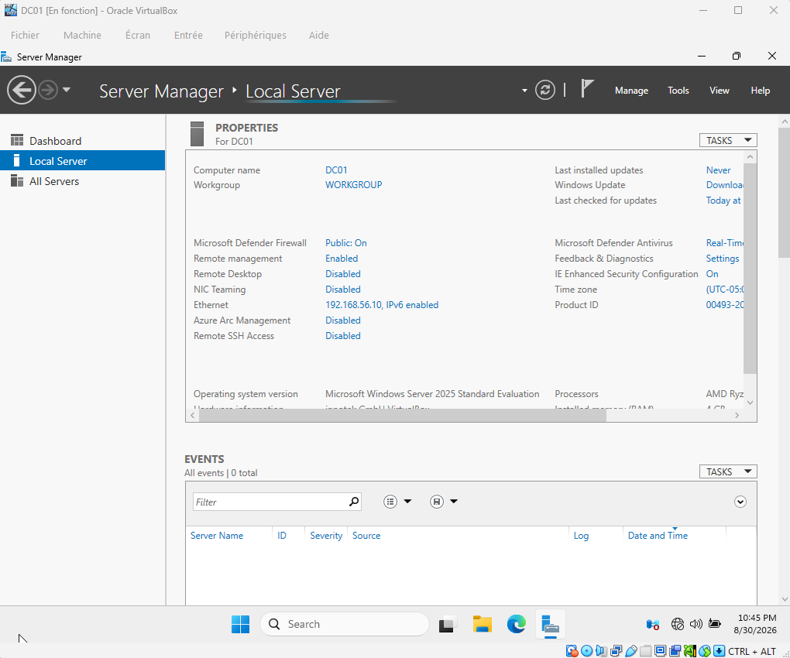
> Pare‑feu Windows activé sur DC01 – profil Public actif.

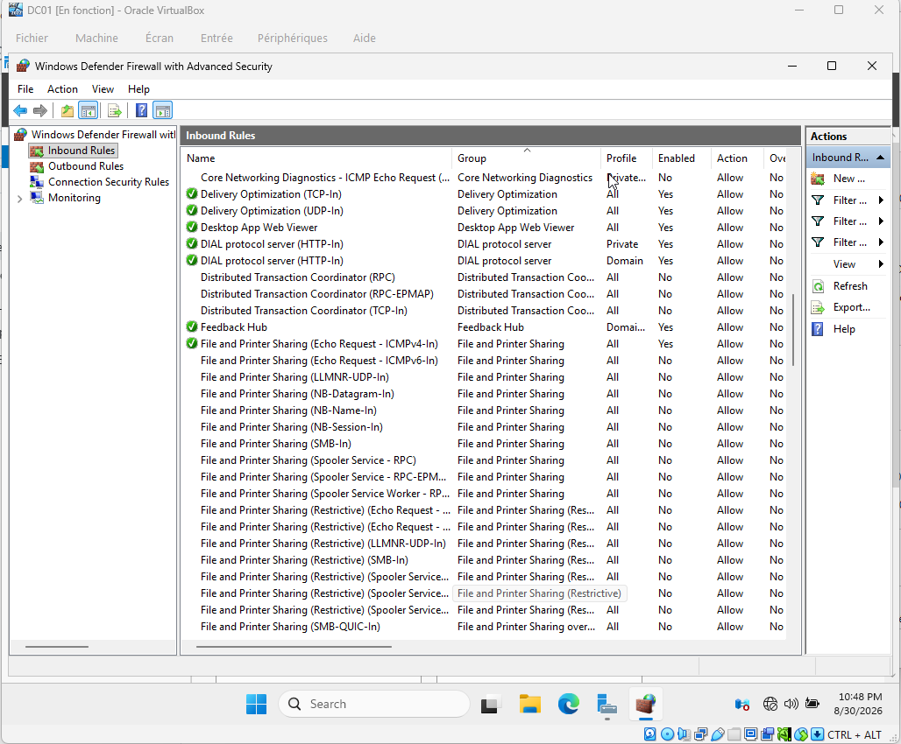
> Autorisation ciblée du protocole ICMPv4‑In pour les tests de ping.

---

### 💻 PC‑Client – Windows 11

Le pare‑feu est également activé sur le profil **Public**, avec la même règle ICMPv4‑In autorisée pour les diagnostics.

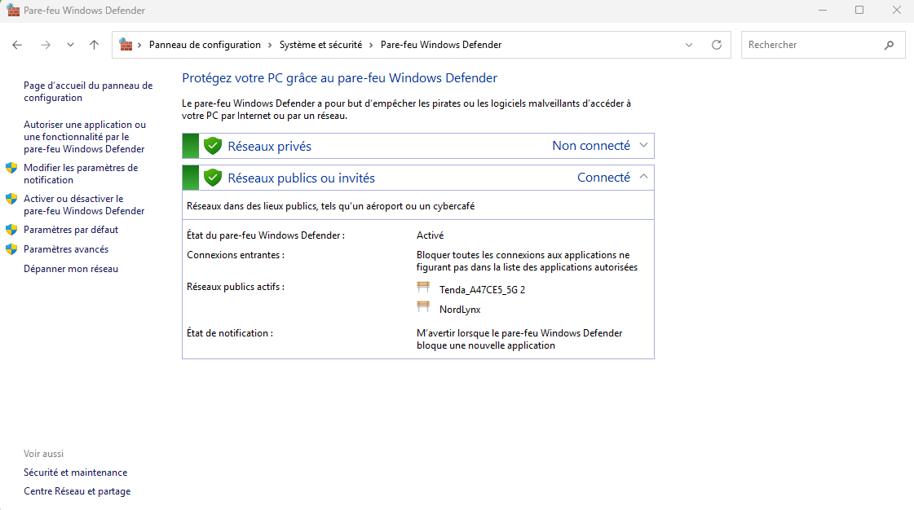
> Pare‑feu Windows activé sur le PC‑Client – profil Public actif.

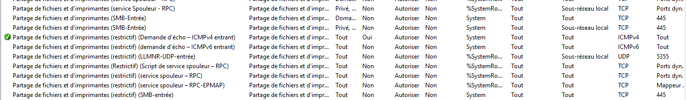
> Autorisation ICMPv4‑In sur le PC‑Client pour les tests de connectivité.

---

### 🧠 Résumé

Cette configuration démontre :
- la maîtrise du pare‑feu Windows sur serveur et poste client ;
- la mise en place d’un profil Public pour une sécurité renforcée ;
- l’autorisation sélective du protocole ICMP pour les diagnostics réseau ;
- la cohérence des règles entre les deux machines du laboratoire.

---

## 🧱 Installation du rôle Active Directory Domain Services (AD DS)

Cette section illustre l’installation du rôle AD DS sur le serveur DC01 et sa promotion en contrôleur de domaine.

### ⚙️ Ajout du rôle AD DS
Le rôle Active Directory Domain Services est ajouté via le Gestionnaire de serveur.

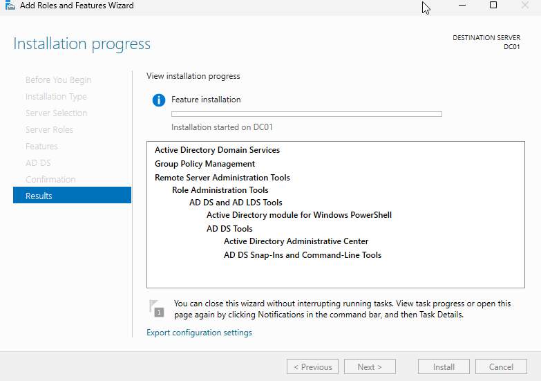
> Sélection du rôle AD DS dans l’assistant d’ajout de rôles et fonctionnalités.

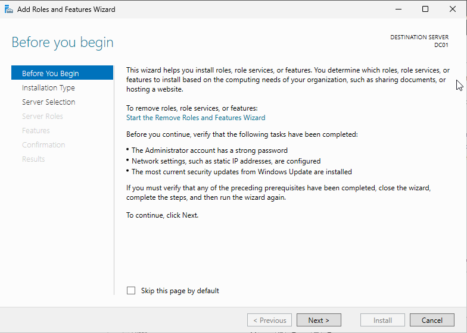
> Vérification des rôles et fonctionnalités nécessaires avant installation.

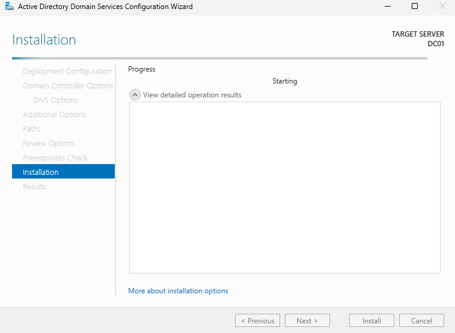
> Progression de l’installation du rôle AD DS sur DC01.

---

### 🧩 Promotion du serveur en contrôleur de domaine
Une fois le rôle installé, le serveur est promu pour créer une nouvelle forêt Active Directory.

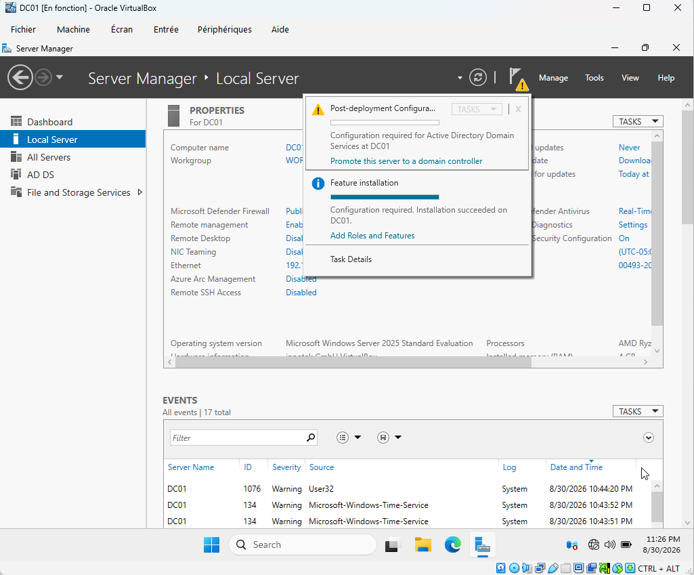
> Lancement de la promotion du serveur en contrôleur de domaine.

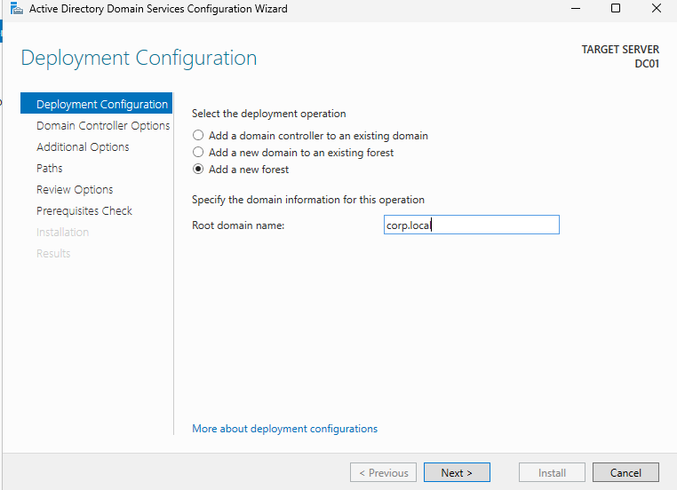
> Définition du nom de domaine pour la nouvelle forêt (exemple : *exemple.local*).

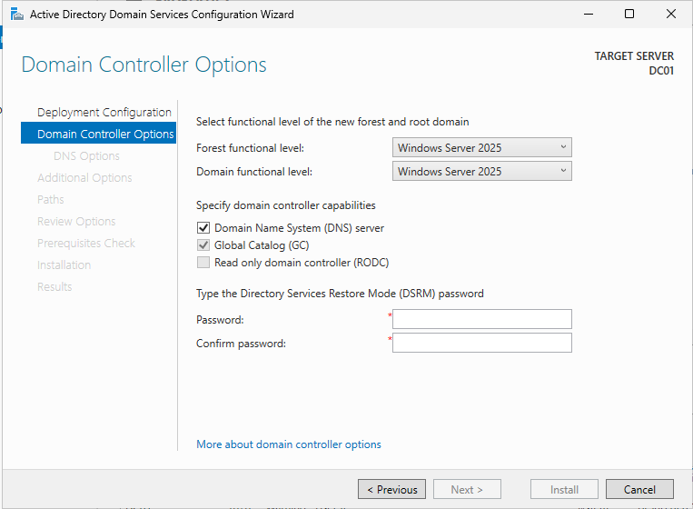
> Paramètres du contrôleur de domaine : niveau fonctionnel, mot de passe DSRM et options DNS.

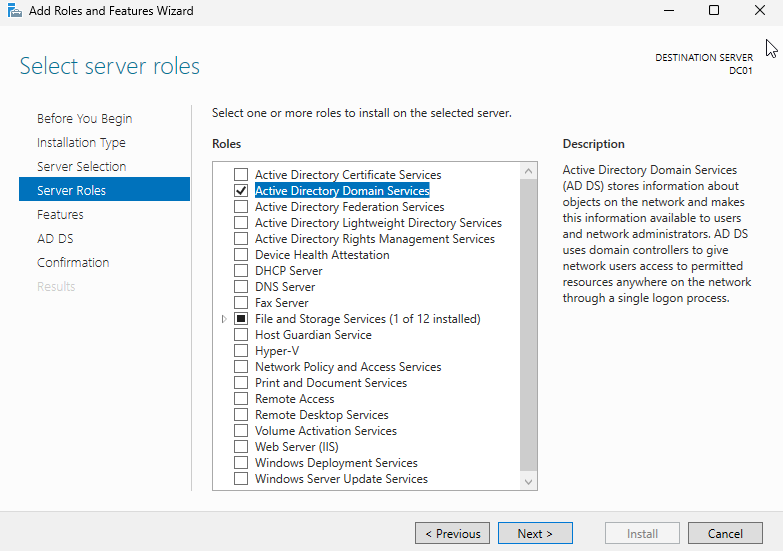
> Vérification des prérequis avant la promotion du serveur.

---

### 🧠 Vérification post‑installation
Après redémarrage, le serveur DC01 est opérationnel comme contrôleur de domaine.

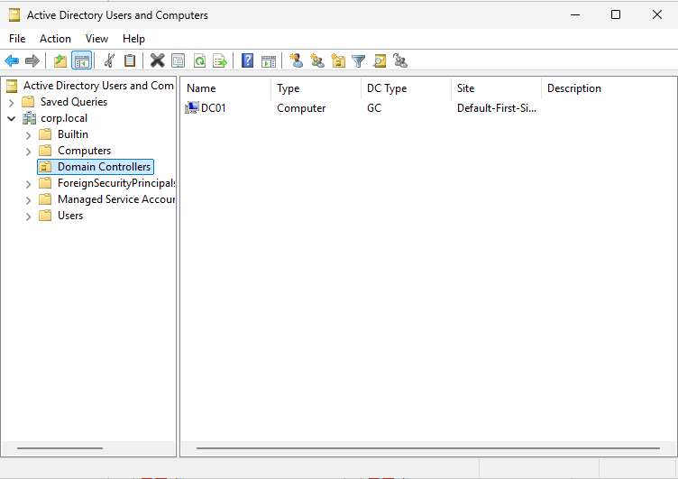
> DC01 est maintenant le contrôleur de domaine de la forêt Active Directory.

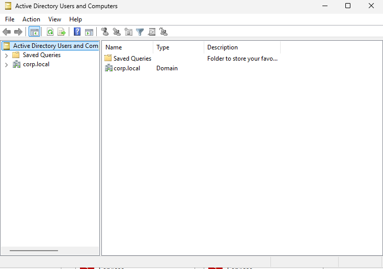
> Console “Utilisateurs et ordinateurs Active Directory” affichant le domaine configuré.

---

### 🧾 Résumé
Cette installation démontre :
- la maîtrise du rôle AD DS sous Windows Server 2022 ;
- la création d’une forêt et d’un domaine fonctionnel ;
- la promotion réussie du serveur DC01 en contrôleur de domaine ;
- la validation de la configuration via la console ADUC.

---

## 👥 Création des utilisateurs et groupes dans ADUC

Cette section illustre la configuration des unités d’organisation, des utilisateurs et des groupes dans Active Directory à l’aide de la console ADUC.

### 🧭 Ouverture de la console ADUC
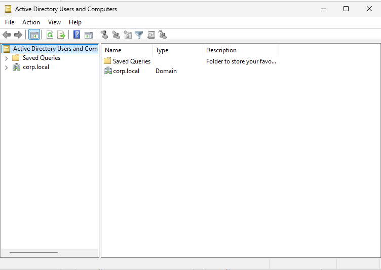
> Console “Utilisateurs et ordinateurs Active Directory” ouverte sur le domaine *exemple.local*.

---

### 🗂️ Création d’une unité d’organisation
Une unité d’organisation (OU) nommée **Employés** est créée pour regrouper les comptes utilisateurs.

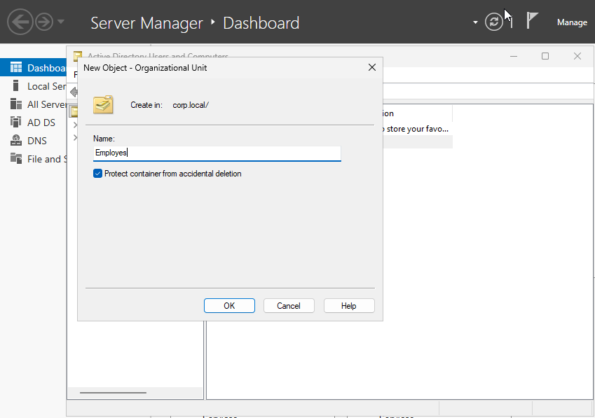
> Création de l’unité d’organisation “Employés”.

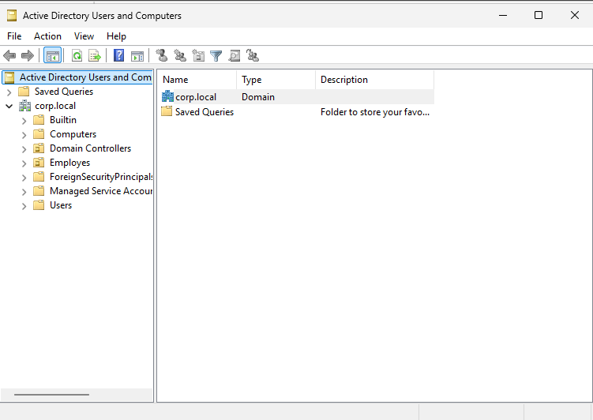
> L’OU “Employés” apparaît dans l’arborescence du domaine.

---

### 👤 Création des utilisateurs
Trois utilisateurs sont ajoutés à l’OU : **Alice Tremblay**, **Bob Gagnon** et **Charlie Dubois**.

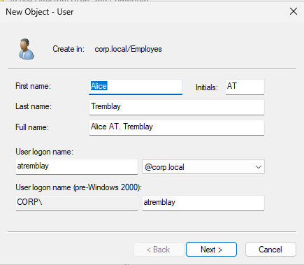
> Fenêtre de création d’un utilisateur dans ADUC.

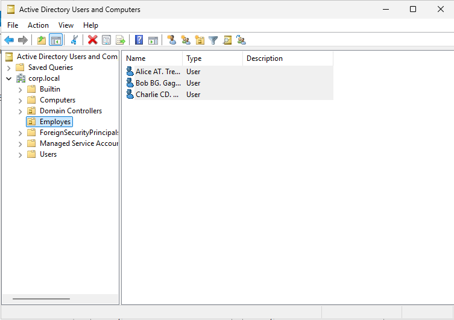
> Les trois utilisateurs créés apparaissent dans l’OU “Employés”.

---

### 🧩 Création des groupes
Deux groupes sont créés pour organiser les permissions : **Groupe_IT** et **Groupe_RH**.

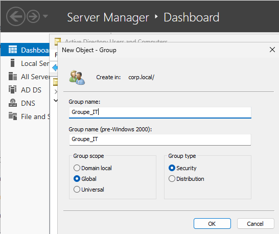
> Création du groupe “Groupe_IT” (type : sécurité, portée : globale).

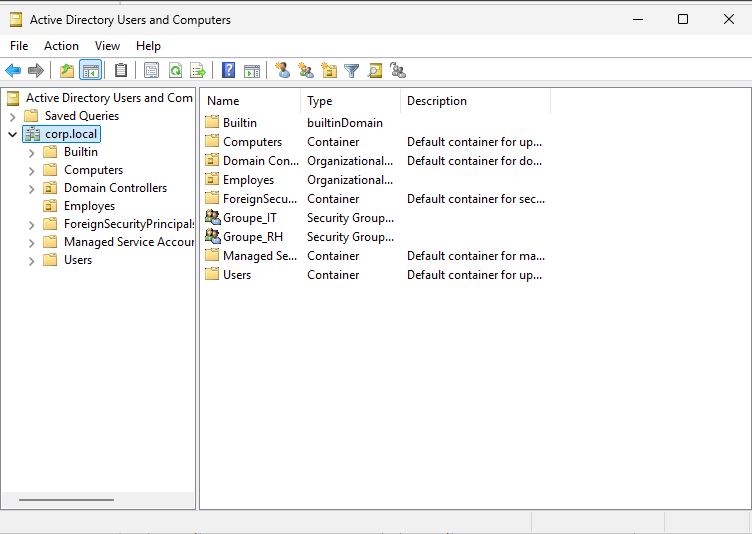
> Les deux groupes visibles dans la console ADUC.

---

### 🔗 Ajout des utilisateurs aux groupes
Les utilisateurs sont ensuite ajoutés aux groupes correspondants :
- Alice et Charlie → Groupe_IT  
- Bob → Groupe_RH

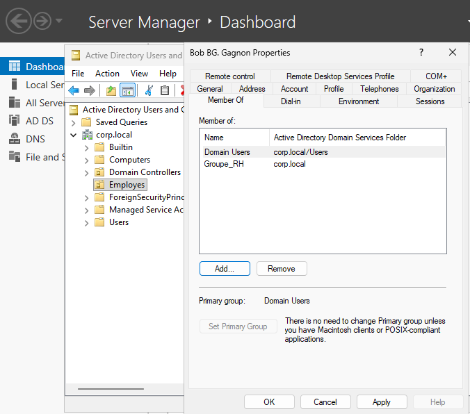
> Ajout d’un utilisateur au groupe via l’onglet “Membre de”.

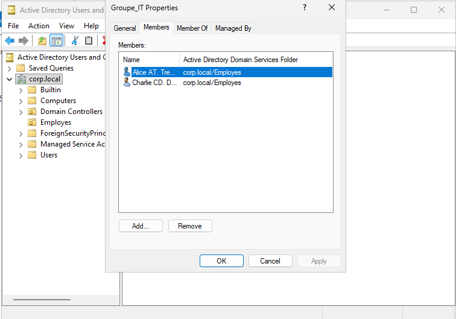
> Vérification des membres du groupe “Groupe_IT”.

---

### 🧠 Résumé
Cette configuration démontre :
- la création d’une structure logique dans Active Directory ;
- la gestion des utilisateurs et des groupes ;
- la mise en place d’une organisation claire pour les permissions et la sécurité.

---

## 🌐 Configuration DNS

Cette section illustre la mise en place du service DNS sur le contrôleur de domaine DC01, essentiel au bon fonctionnement d’Active Directory.

### ⚙️ Création de la zone directe
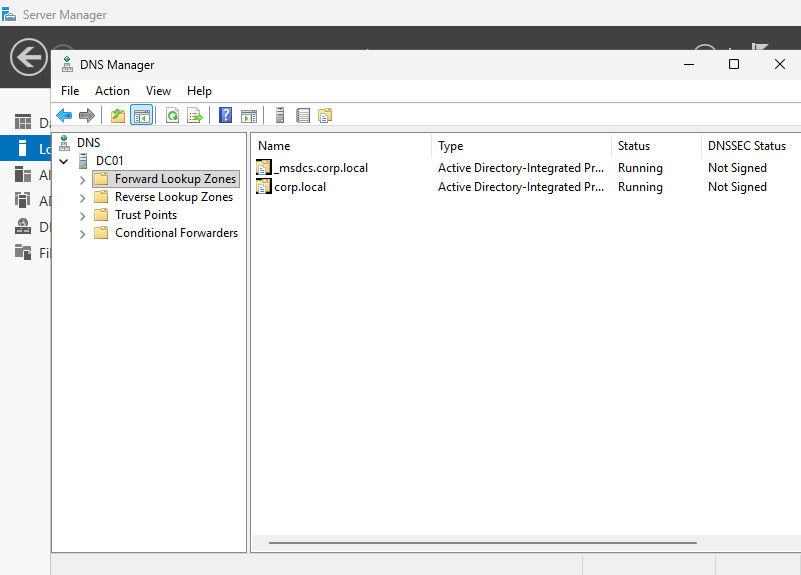
> Création de la zone de recherche directe pour le domaine *corp.local*.

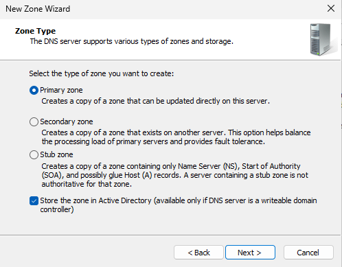
> Sélection du type de zone : Primary Zone.

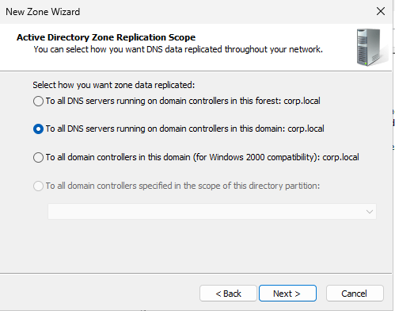
> Choix du mode de réplication DNS pour les contrôleurs du domaine *corp.local*.

---

### 🧩 Création de la zone inversée
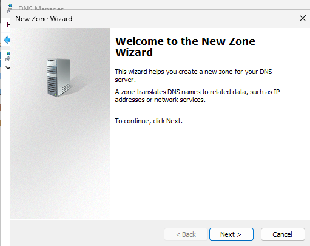
> Assistant de création d’une zone de recherche inversée IPv4.

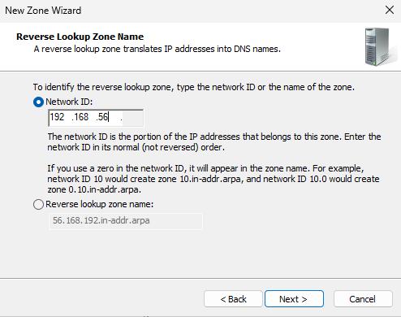
> Définition du Network ID : 192.168.56.

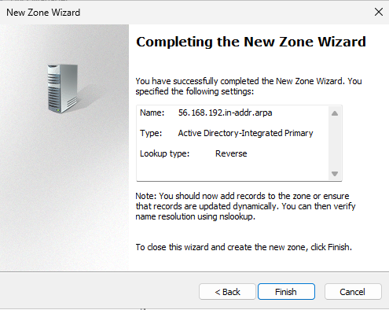
> Zone inversée 56.168.192.in‑addr.arpa créée avec succès.

---

### 🔧 Configuration de l’enregistrement PTR
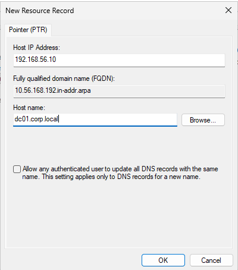
> Ajout d’un enregistrement PTR pour l’adresse IP 192.168.56.10 pointant vers *dc01.corp.local*.

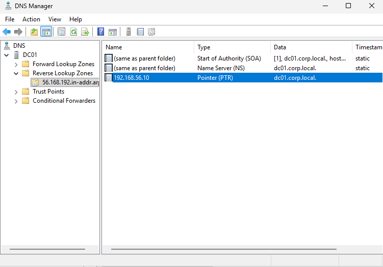
> Enregistrement PTR visible dans la zone inversée.

---

### 🧠 Vérification des enregistrements DNS
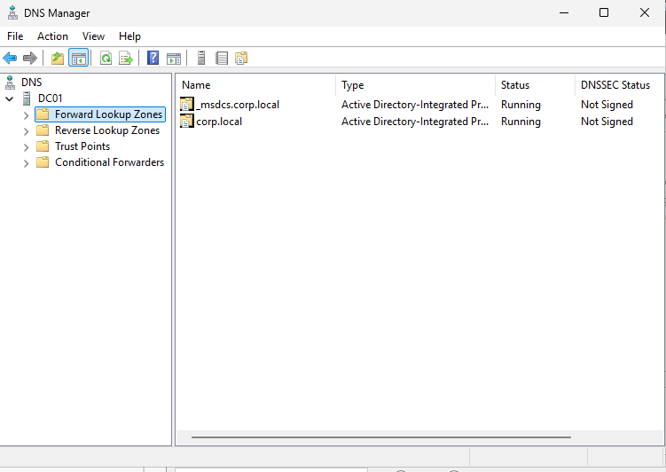
> Vérification des enregistrements A et PTR dans la console DNS.

---

### 🧪 Tests de résolution DNS
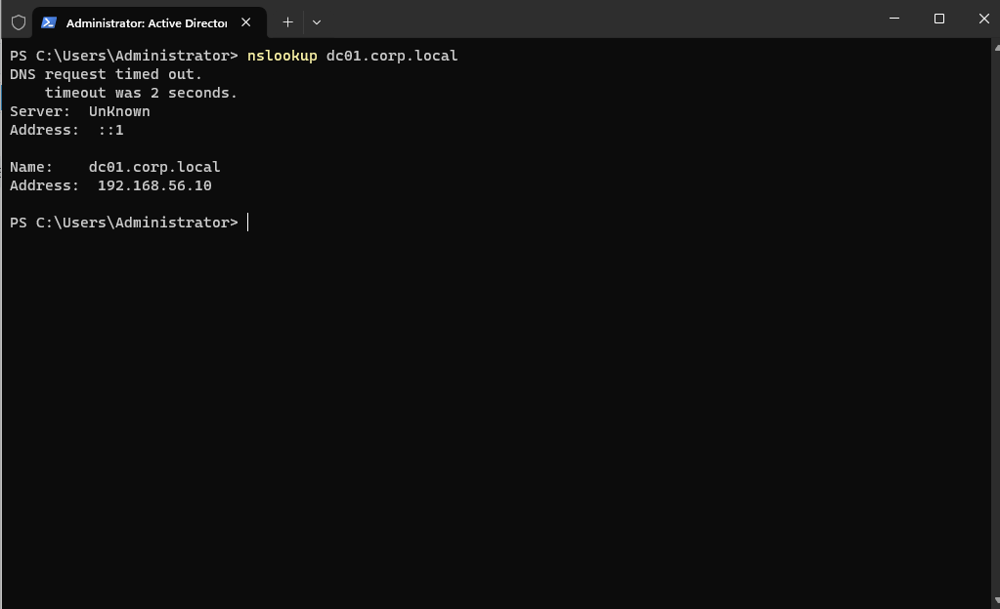
> Test `nslookup dc01.corp.local` : résolution directe réussie.

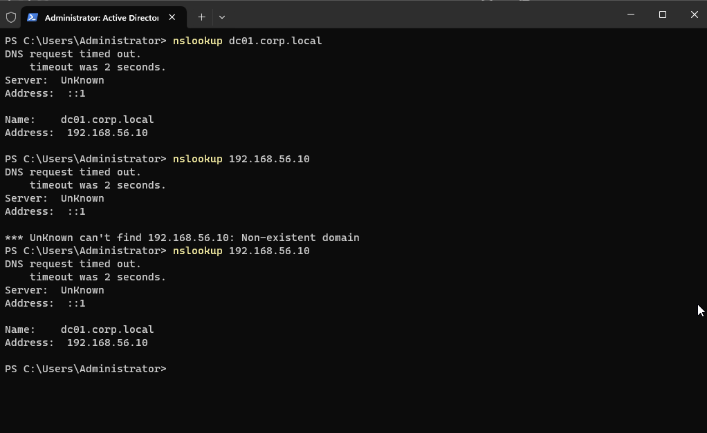
> Test `nslookup 192.168.56.10` : résolution inversée fonctionnelle.

---

### 🧾 Résumé
Cette configuration DNS démontre :
- la création des zones directe et inversée ;
- la mise en place d’un enregistrement PTR pour DC01 ;
- la validation de la résolution directe et inversée via `nslookup`.

---

## 🧠 Compétences démontrées
- Virtualisation (VirtualBox)
- Administration Windows Server
- Active Directory
- Sécurité Windows
- GPO
- Documentation professionnelle

---

## 📬 Contact
Pour toute question ou opportunité professionnelle :  
bonneautommy00@gmail.com
