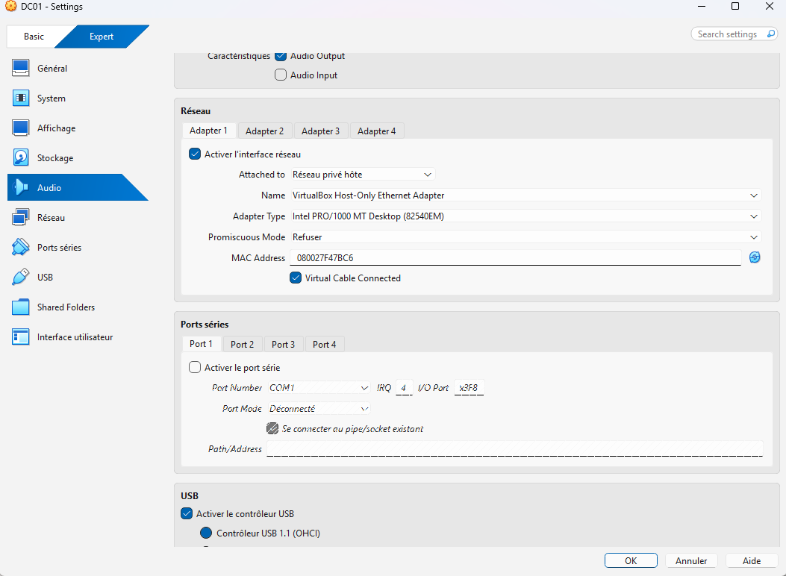
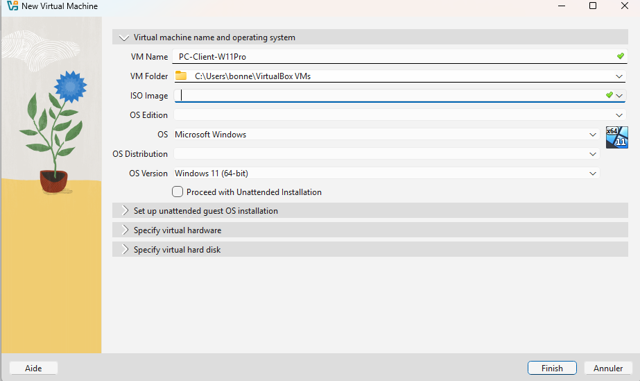
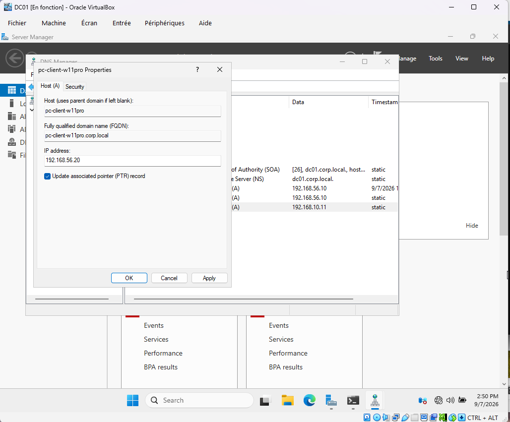
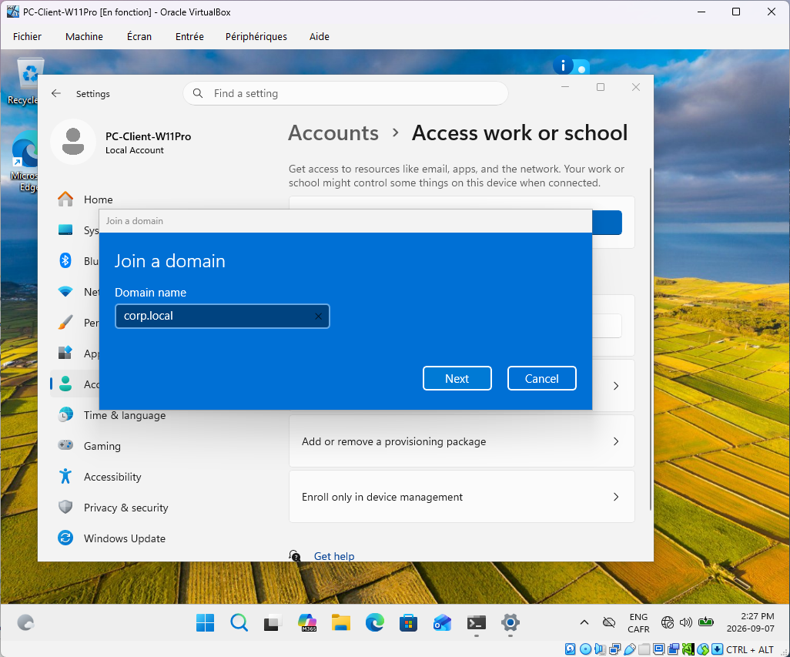

# 🌐 Portfolio – Administration Système & Cybersécurité

Bienvenue sur mon portfolio professionnel.  
Je m'appelle **Tommy**, passionné par l'administration système, la cybersécurité et la virtualisation.

Ce portfolio présente mes projets techniques, dont un laboratoire Active Directory complet configuré dans un environnement sécurisé.

---

## 🛠️ Projet : Laboratoire Active Directory (VirtualBox + Windows Server)

### 🎯 Objectif
Mettre en place un environnement Active Directory complet dans VirtualBox, en respectant les bonnes pratiques de sécurité.

---

## 🧱 Architecture du laboratoire

**DC01 – Windows Server 2022**
- Rôle : Contrôleur de domaine  
- IP : 192.168.56.10  
- Réseau : Host‑Only  
- Pare‑feu : Profil Public (activé)

**PC‑Client – Windows 11**
- Rôle : Client du domaine  
- IP : 192.168.56.20  
- Réseau : Host‑Only

---

## 🌐 Réseau & VirtualBox

### ⚙️ Configuration du réseau Host‑Only

---

### 🧩 Paramètres IP des machines

**DC01 – Windows Server 2022**  

**PC‑Client – Windows 11**  

---

### 🔍 Vérification de la connectivité

---

## 🔐 Sécurité – Pare‑feu Windows

### 🧱 DC01 – Windows Server 2022

---

### 💻 PC‑Client – Windows 11

---

## 🧱 Installation du rôle Active Directory Domain Services (AD DS)

### ⚙️ Ajout du rôle AD DS

---

### 🧩 Promotion du serveur en contrôleur de domaine

---

### 🧠 Vérification post‑installation

---

## 👥 Création des utilisateurs et groupes dans ADUC

### 🧭 Ouverture de la console ADUC

---

### 🗂️ Création d’une unité d’organisation

---

### 👤 Création des utilisateurs

---

### 🧩 Création des groupes

---

### 🔗 Ajout des utilisateurs aux groupes

---

## 🌐 Configuration DNS

### ⚙️ Création de la zone directe

---

### 🧩 Création de la zone inversée

---

### 🔧 Configuration de l’enregistrement PTR

---

### 🧠 Vérification des enregistrements DNS

---

### 🧪 Tests de résolution DNS

---

## 🧩 Création du poste client et intégration DNS

---

## 🔐 Attribution des permissions

---

## 🧠 Compétences démontrées
- Virtualisation (VirtualBox)  
- Administration Windows Server  
- Active Directory  
- DNS  
- Sécurité Windows  
- GPO  
- Documentation professionnelle  

---
